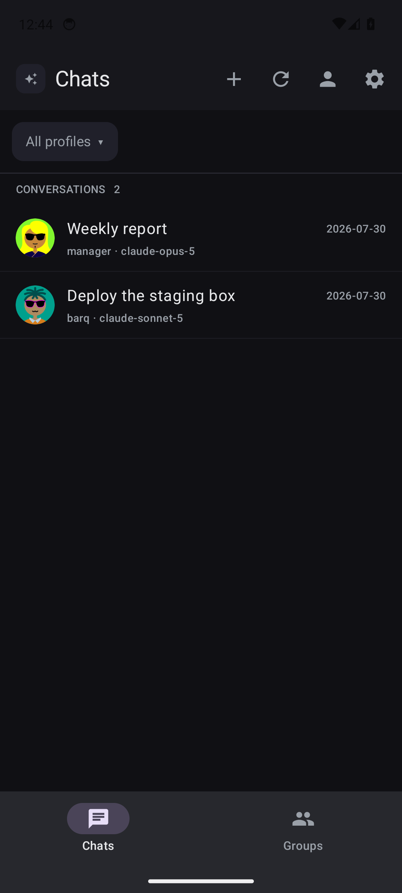
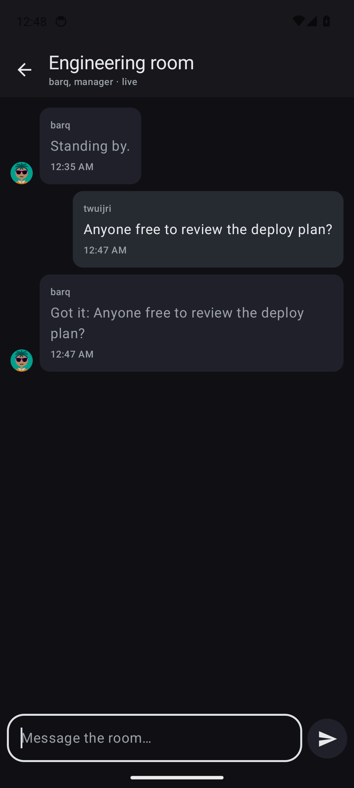

# Core Hub Mobile — Android

The native Android client of Core Hub (twuijri's personal fork of
[Hermes Studio](https://github.com/EKKOLearnAI/hermes-studio); see the root
`LICENSE` and `docs/PERSONAL-FORK.md`). It talks to the same HTTP and Socket.IO API
as the web client and renders a native, phone-shaped interface instead of wrapping a
web view — with the web app's design system and navigation, so it feels like the
same product (`docs/mobile/DESIGN-SPEC.md` is the authoritative spec).

## What works today (v1.4.0)

- **Replies stream in as they are written**, over the same `/chat-run` socket the
  web UI uses, with a stop button that calls the run off mid-sentence. If the
  socket cannot be reached the app quietly falls back to the REST wrapper, so a
  reverse proxy that blocks WebSockets costs you the streaming, not the answer
- **The reasoning is kept**, folded under the reply, and the composer says which
  tool the agent is running while it works
- **Manage conversations**: long-press to rename, pin, categorise, archive, export
  or delete one; the History page adds search over titles and message text, an
  "All profiles" and an "Archived" filter, and a batch selection that archives,
  restores, moves or deletes many at once
- **Manage profiles**: create, rename and delete them from the profiles screen
- **Group chat is a room, not a list**: create or duplicate a room, join one by
  its invite code, fill its seats from agent presets, and watch replies stream in
  with per-agent activity, typing, the execution queue and inline approvals. Room
  settings carry the workspace, the members, the invite link with its QR, agent
  handoff and its chains, the running summary, and "clear the context"
- **A room writes with the same composer as a conversation**: one component,
  `ui/chat/Composer.kt`, used by both screens — the same card, the same attachment
  sheet, the same microphone with its long-press language list, the same
  content-direction rule and the same send button
- **Workflows run from the phone**: the list shows a live status chip per workflow,
  a workflow shows its graph in execution order (read-only — the editor stays on
  the desktop), its schedules with enable/disable, and its runs. A run opens a node
  timeline with each node's status, timing, output, an inline approve/reject for a
  node that waits on a person, and rerun-from-node
- **Navigation is the contract's** (`docs/mobile/NAVIGATION.md`, derived from the
  desktop client and shared verbatim with iOS). One registry,
  `navigation/NavDestination.kt`, names every place the app can go; the entry that
  opens a destination and the title of the screen it opens read the same
  `nav_*` string, so what you press is what opens. The map, top to bottom:
  - **Drawer** (app-bar hamburger, or an edge swipe): the primary rail — `New chat`,
    `Search` (a sheet over the sessions with its field focused, recent sessions when
    empty, snippets when not; a `global_agent` hit opens the Global Agent's
    conversation), `Device connections`, `Agent Manager` (super-admin), `Models` —
    then the four-segment switch `Chat · Group Chat · Workflow · History`, the list
    that segment selects, and the footer (profile chip that only switches, model
    chip, Sign Out, the username, the settings gear, connection status, language and
    theme toggles, version, GitHub). Opening a session leaves the selected segment
    alone
  - **Settings** (the gear): one screen. The web's tabs in the web's order —
    Current Account, Account Management, Webhooks, Display, Proxy, Compression,
    Privacy, Models (the key form, titled "Provider keys", with a link to the Models
    page) — then `This device` and `About`, then a `Tools` section: `Logs`, `Usage`,
    `Performance` (super-admin), `Skills Usage`, `Theme`, `Pets`, `Profiles`
    (super-admin). Each row is a different screen with the row's own title
  - **Agent Manager**: the agent cards, nothing else. A card opens its agent:
    Hermes lists `Jobs · Kanban · Channels · Skills · Plugins · MCP · Memory ·
    Journey · Settings` (Agent / Memory / Session tabs); Ekko lists `Memory ·
    Skills · MCP · Settings`; a coding agent lists `Skills · MCP · Settings` —
    the DeepSeek Harness (`dsh`) alone puts `Plugins · Presets` in front of them
    (`CodingAgentConfigSidebar.vue:19-24`) — and keeps install, update and remove
    on its card: when a check finds a newer version the card shows one compact
    `Update` button under the state pill and the offered version on its meta
    line. The Hermes card also carries `CLI details`. There is no runtime
    installer on the phone: the server's Hermes runtime is part of its Docker
    image, so `Manage runtime` (runtime packages) stays in the desktop app
  - **No menu entry, as on the web**: the Global Agent (reached from search hits
    and from the banner that appears when a Global Agent session needs you) and
    Files (a profile card's `Edit config`)
  - **Back** follows the real visit history — a screen reached from two places
    returns to the one you came from — and falls back to the selected segment
- **Models is the web's Models page, not a key form**: the drawer's Models item opens
  a page of provider cards — each provider's id, base URL, API mode, credential
  state, catalogue status, default model and the models it offers as chips you can
  rename — plus the actions the web offers there (make default, visible models,
  refresh, restore, test, delete or clear credentials) and the fallback chain.
  API keys stay in Settings → Models, which is where the web keeps them too
- **Agent Manager lists agents**: the eight agents Core Hub declares — Hermes, Ekko
  and the six coding agents — grouped as built-in, Hermes runtime and coding agents,
  each with its install state, version, source, npm package and any error the server
  reported. Install, reinstall, update, check for an update, delete and the
  auto-update switch all work, and every coding-agent card opens that agent's own
  settings: the instruction file and the configuration file the web edits. Agents the
  server never reported are shown as "not on this server" rather than dropped, and
  the page says plainly that installing runs on your server, not on the phone
- **Mobile Kanban inspired by modern task apps**: switch boards, search, create a
  task, inspect its result and runs, assign it, and comment. Hold a card and drag
  left or right to move it between stages, or use its Move menu for precise and
  accessible control
- **Skills are native and editable** for Hermes, Claude, and Codex targets: search,
  enable, pin, import a ZIP, open `SKILL.md`, edit it, save it, or delete a local
  skill
- **Plugins, MCP, and Pets are native too**: inspect or toggle standalone plugins;
  add, edit, test, reload, and delete MCP servers without losing advanced JSON
  (Hermes' under the Hermes card, a coding agent's under its own card, Ekko's under
  Ekko); and adopt, enable, or resize a companion from Settings › Tools › Pets
- **Channels are set up from the app**, on their own screen: enter a bot token (or
  the app id, secret and the rest — each channel asks for exactly the fields the
  server maps), turn a channel on or off, or remove its credentials. Saving writes
  into your server and it restarts the gateway itself, so the channel comes up ready
- **Scheduled jobs (Cron Jobs) are fully manageable** for the active profile:
  create and edit the schedule, prompt, model, skills, delivery target and repeat
  limit; pause or resume it, run it immediately, delete it, and read its run output.
  Every call uses the same profile-scoped endpoints and `X-Hermes-Profile` header
  as Studio.
- **Settings are the person's; the agent's are under the agent** (NAVIGATION.md
  rule 2): the Settings screen holds account, display, proxy, compression, privacy
  and provider keys, plus *This device* (voice input, dictation language, spoken
  replies, the in-app update) and *About*. Hermes' own runtime settings — max
  turns, gateway timeout, restart drain timeout, tool enforcement, **gateway
  auto-start with its profile policy**, memory, approvals, skill approvals and the
  session reset — are Hermes › Settings, three tabs, under the Hermes card. Every
  native value is read from and saved to the active profile through the same
  contracts as the web UI
- **The system back button behaves**: it closes the drawer, walks back through the
  visit history — a conversation, a room, an agent's section, a settings tool —
  returns the Group Chat, Workflow and History sections to Chat, and only closes
  the app from the Chat section
- **Confirmation before anything you cannot undo**: signing out and restarting a
  profile's gateway both ask first, naming the profile that will stop answering
- **Ready for other languages**: every string lives in one file, adding a language is
  a copy plus two lines, and a test fails the build on a missing key or a broken
  placeholder. Right-to-left layouts are handled too, mirrored icons included, and the
  language is picked in Settings or before signing in — see
  [docs/adding-a-language.md](docs/adding-a-language.md)
- **The same profile pictures Studio shows**: an uploaded avatar, or the abstract
  `boring-avatars` beam the web draws from the same seed — generated on the device
  and cached, so a launch draws them from disk instead of pulling them again
- **Your Studio logo as the app mark**, fetched from your own server (`/logo.png`) and
  cached; swap it for any picture on your phone from Settings → This device
- **First-run walkthrough** explaining what the app is and that you supply the
  Hermes Studio server yourself
- **Splash while the stored session is verified** — the sign-in form only appears when
  you actually need to sign in
- Sign in with your Studio server address, username and password (or the QR code above)
- Bearer token stored in `EncryptedSharedPreferences`, backed by the Android Keystore
- **Your existing conversations in the web's session list**: RECENT (count gear,
  1–100), Pinned, categories and Uncategorized groups with collapsible headers;
  two-line rows with pin, unread dot, title, `HH:mm` or `Sep 18`, the runtime avatar
  (Hermes, Ekko, Claude, Codex, Pi, Grok, OpenCode, DeepSeek), the profile chip and
  the category tag; a 500 ms long-press menu to rename, pin, categorise, archive or
  delete; search and bulk delete on the History page
- **Open any conversation and read its real history** pulled from the server, then keep
  talking in the same session
- **All profiles filter**, matching Studio's dropdown, or scope the list to one profile
- **Group chat tab**: rooms with agent and member counts, open a room to read its messages
- **Composer laid out like Studio's**: a full-width field with a `+` button and
  context chips underneath, and a single trailing button that is the microphone until
  you type, then becomes send
- **The `+` opens a bottom sheet**, not a menu hanging off the button: a drag handle, the
  title *Attach files* over a muted line, then PHOTOS — *Take photo* · *Photo library* — a
  divider, DOCUMENTS — *Files* — and a full-width *Close*. One comfortable row per action
  (icon tile, label, caption, chevron), mirrored in Arabic. A new action is one more row
- **Change the model** per conversation, applied with `POST /api/studio/sessions/{id}/model`
- **Change reasoning effort** (default, low, medium, high), sent as `reasoning_effort`
  on every run, the same field the web composer sets
- Attachments upload to your server and ride along with the message as proper
  content blocks
- **Voice, on the device by default**: tap the microphone and the words appear in the
  composer as you speak (Android speech recognition, inserted at the caret); nothing is
  sent until you press send. Settings → Voice switches to the **Core Hub server** path
  instead, which records a 16 kHz WAV and transcribes it with the STT provider
  configured in Studio. The mic shows idle, listening, transcribing and error states,
  and every failure is shown in words
- **A recording mode, modelled on the Claude app's.** Tapping the microphone turns the
  row of pills under the text into a recording strip — a round **✕** at the leading
  edge, a **live waveform** filling the middle, a round **■** and the round **↑** —
  with the drawer's 150 ms fade (an immediate swap when animations are off in the
  system settings). The transcript keeps appearing in the field above and the field
  stays editable throughout. The three endings are different things: **✕ cancels** the
  take and puts the draft back exactly as it was before the take began; **■ stops** it
  and keeps the text, and the pills return; **↑ stops** it and sends once the engine's
  final text has landed in the draft. The mic's long press still opens the language
  list whenever the strip is not showing
  - The waveform is **real audio levels, from the source already open**: the
    recognizer's own `onRmsChanged` reading for an on-device take (about −2…10 dB on
    Google's engine, normalised to 0…1), or the PCM the server recorder is already
    capturing. Nothing opens the microphone a second time. Levels go through the same
    `AudioLevelMeter` as on iOS — instant attack, an exponential release of 0.8 per
    50 ms tick, idle under 0.06 — and are published about twenty times a second on a
    flow of their own, so the strip redraws without recomposing the composer.
    Thirty-six bars in the accent, newest last; a bar that heard nothing is a dot at
    40 %
  - The strip **mirrors under RTL** so ✕ stays at the leading edge, while the waveform
    itself is a timeline and stays pinned LTR. TalkBack meets the same three controls
    with the same labels and hints as VoiceOver on iOS, and the waveform's description
    names the take's language and the current level (*Recording in العربية, Level 40 %*)
  - The rules (`RecordingStrip.kt`) and the levels (`DictationLevels.kt`,
    `AudioLevelMeter`) are pure and covered by unit tests; only the drawing
    (`ui/chat/RecordingStripRow.kt`, `RecordingWaveform`) is Compose
  - **The take runs until you end it, across pauses.** Android's `SpeechRecognizer` is
    built for one utterance: its endpointer ends the session at the first pause of a
    second or two (`onEndOfSpeech` → `onResults`, or `ERROR_SPEECH_TIMEOUT` /
    `ERROR_NO_MATCH` when it heard nothing usable), and the intent's silence extras are
    documented as hints that "may have no effect" — Google's engine ignores them, which
    is what made build 48 stop by itself after one sentence. So a take is now a **chain
    of sessions** (`ContinuousDictation.kt`, pure and unit-tested): a session that ends on
    its own is restarted at once with the very same intent (language, detection list and
    switch settings included), its final text is committed into the draft with the
    merge's own separators, the next session's partials append after it, and the strip
    and the *Listening in …* line never change. `ERROR_NO_MATCH` and
    `ERROR_SPEECH_TIMEOUT` mid-take are not errors. The chain ends only with **■ / ↑ / ✕**,
    a real error (microphone, permission, network for a server-bound engine, or an engine
    still busy after one retry on a fresh recognizer), or a **ten-minute ceiling** that
    keeps the text and says so above the composer. ↑ that lands in the gap between two
    sessions sends the committed text at once without waiting for an engine; ■ that the
    engine never answers gives up after four seconds and keeps what it heard. The silence
    extras are still set, generously, for engines that do honour them
- **Dictation language, per profile**: *Settings → Dictation language* chooses what the
  microphone listens for — *follow the app language* (the default, and what earlier
  builds always did), a specific language, or *detect automatically*. **Long-press the
  microphone** in the composer to open the same list without leaving the conversation,
  and the recording row names the language the take is actually running in.
  - The languages offered are the ones this device reports, through
    `SpeechRecognizer.checkRecognitionSupport` on Android 13+ and the
    `RecognizerIntent.ACTION_GET_LANGUAGE_DETAILS` broadcast below that, shown by their
    endonyms (`العربية`, `Français`). A device that reports nothing gets a short curated
    list, clearly marked *not confirmed by this device*
  - *Detect automatically* runs **on the phone**: `EXTRA_ENABLE_LANGUAGE_DETECTION` and
    `EXTRA_ENABLE_LANGUAGE_SWITCH` over the languages the app ships plus the phone's own
    locale, intersected with what the engine says it has, and the engine reports what it
    heard through `RecognitionListener.onLanguageDetection`. No audio goes to Core Hub
    for it. Those extras are **Android 14 (API 34)** and later
  - **The app reports what it found, it does not assume.** The support query now carries
    the detection extras, so "this engine accepted a request to detect" is answered
    separately from "this engine can hear speech" — the two used to be conflated, and a
    plain probe was being read as proof of detection. When detection is not running the
    recording row names the reason it is not: the Android release and API level this
    phone reports, an engine that never answered, an engine that refused a detecting
    intent, or fewer than two of your languages having a model installed. The same
    sentence appears under *Detect automatically* in the language sheet
  - **A take in the wrong language never looks like a success.** When automatic could not
    run, when the engine was detecting and never named a language, or when the locale had
    to be moved, the composer keeps a warning above the text it produced until you
    dismiss it — not a notice that disappears while the text stays
  - **A locale the engine does not have is replaced, by name.** `en-SA` — an English
    phone in Saudi Arabia, which is what the owner's device reports — is a real Android
    locale and almost no engine has a model for it. The take runs in a variant of the
    same language that the engine did list, and the recording row says which one it left
  - **The microphone's long press is mentioned occasionally.** A light line above the
    composer on the first three recordings of a profile and then every fifth to tenth,
    and never again once the long press has been used. The counter is per profile
- **Settings → Voice** picks who reads a reply aloud, per profile: *Core Hub default*
  (whatever the server has active), any TTS provider Core Hub has configured for that
  profile, or *Device voice* (the Android engine, nothing leaves the phone). Picking a
  server provider also writes it with `PUT /api/studio/tts/settings/active`, the same
  endpoint the web's voice connections screen uses; nothing else on the phone ever
  changes the server's active provider
- **Sign in by scanning the QR code** Core Hub shows under Device connections → App →
  Direct connection: the server address comes from the code and the phone appears as
  a named device on the server. Username and password remain as the second option
- **The device token renews itself**: refreshed silently on launch when it has under a
  week left or was last refreshed more than a day ago, and once after any `401`, with
  the request retried; a revoked token sends you back to the login screen with a message
- Profiles screen to switch which agent a new chat talks to
- Start a fresh conversation at any time
- **Core Hub's "Pure Ink" light and dark palettes** from one token file
  (`ui/theme/CoreHubTokens.kt`), following the system or the setting; RTL-aware
  layout with per-string direction (Arabic titles and messages read correctly, code
  and model ids stay left-to-right)
- **Content direction is the content's, not the interface's** (`docs/CONTENT-DIRECTION.md`).
  `ContentDirection.kt` is the Android half of the web's `dir="auto"` +
  `unicode-bidi: plaintext`: first strong character, per paragraph, isolated runs
  skipped, digits and punctuation not treated as evidence. The chat composer, the group
  composer and the clarification answer field take their own direction from what was
  typed, so Arabic in an English app starts at the right edge of the card — the composer
  used to measure its text at content width inside a box pinned to the interface's start,
  which left a right-aligned Arabic line beginning in the middle of the composer
- **It updates itself from your own server**: the app asks your Core Hub whether a
  newer test build exists, shows a quiet notice with the version and what changed,
  downloads it with resumable progress and hands it to Android's installer — no
  GitHub account or token on the phone. See [Updating from inside the app](#updating-from-inside-the-app)

## Changed in M1 (Core Hub mobile branch)

- Every Studio-owned call uses its canonical `/api/studio/*` route: sessions, session
  search and categories, conversation messages and context length, group-chat rooms,
  STT, TTS, file downloads, the chat-run REST wrapper, usage and performance. The
  "try `/api/studio`, then fall back to `/api/hermes`" negotiation is gone; the server's
  legacy shim is no longer relied on. Profiles, config, available models, skills,
  plugins, MCP, kanban and jobs stay under `/api/hermes/*`, where they are canonical
- QR pairing through `POST /api/auth/app-login` with a stable per-install `device_code`
  kept in `EncryptedSharedPreferences`, and silent renewal through
  `POST /api/auth/app-refresh`
- Dictation on the device with live text, the Core Hub server as a setting, and the
  server path corrected to the Studio contract (profile status first, PCM WAV, `provider`
  and `language` fields, `no_speech_detected` shown as a message)
- Network failures that used to vanish inside `runCatching { … }.getOrNull()` now reach
  the error bar

## Changed in M2 (design system + navigation)

- `ui/theme/CoreHubTokens.kt` is the single source of colours (light/dark), state
  alphas, type ramp, radii, shadows and metrics from `docs/mobile/DESIGN-SPEC.md`;
  `CoreHubTheme` maps them onto Material 3 so every component picks them up, and
  `CoreHubIcons` carries the web's line icons
- Off-canvas drawer + hamburger instead of three bottom tabs; Chat, Group Chat,
  Workflow and History are sections of the same shell; Agent Manager (super-admin),
  the settings drawer and the tabbed Settings page follow the web's order. The
  drawer is at most 300 dp wide and at most 84 % of the screen, square with a
  hairline down its outer edge, and opens with an 18 dp edge swipe. Its open state
  lives on the view model (`UiState.drawerOpen`), not in `HomeShell`, so changing
  section does not take the open drawer with it. The segmented bar draws a 16 dp
  icon above each 10 sp label and slides a bg.card thumb to the selection in
  150 ms. `DrawerParityTest` and `DrawerRtlTest` pin these values against
  `clients/ios/HermesStudio/Features/SidebarDrawer.swift`
- The session list, chat header, message bubbles and composer surfaces use the tokens
  (bubble radius 10, composer card 18 with the spec shadow, 16 sp input, pill buttons)
- Bottom sheets use the same tokens: `ui/chat/AttachmentSheet.kt` (the composer's `+`) is a
  `ModalBottomSheet` on `bg.card` with a 40 % scrim, radius-18 top corners, a 36 × 4 handle at
  accent @ 18 %, 20 dp gutters, rows at least 56 dp tall, a 40 dp icon tile (accent @ 6 %,
  border-light hairline, radius 10) around a 20 dp Core Hub line icon, a 14/600 label over an
  11 sp caption, and an auto-mirrored chevron. Sheet metrics live in
  `CoreHubTokens.Metrics.sheet*`; `AttachmentSheetTest` fails the build if a colour, radius or
  size is written into the sheet instead, or if iOS drifts out of order
- Branding: the app is "Core Hub", the launcher icon is the vector mark on the splash
  colour, the bundled logo is the in-app mark until the server's is fetched, and the
  coding-agent avatars are bundled

## Changed in M3 (chat parity with the web client)

- **Message rows per the spec**: user bubbles end-aligned at 75 %, assistant rows with
  the 22 dp avatar and author label at 80 %, system notices with the inline-start
  warning border, slash-command acknowledgements, error rows, and pulsing dots while a
  reply has not produced text yet
- **Tool card and thinking block**: a collapsible "N tools" card (30 dp header, rotating
  chevron, wrench, up to three tool names, ✓ / ••• / ✕) whose lines open Thinking /
  Arguments / Result sections from `tool.completed` / `tool.failed` (truncation is
  labelled); a 💭 Thinking · Observed {duration} · {count} chars block fed by
  `reasoning.delta`, `thinking.delta` and `reasoning.available`. "Show tool calls" in
  the composer's ⚙ menu hides the card
- **Action row under every message**: play/pause voice (server TTS through
  `POST /api/studio/tts/synthesize`, falling back to Android TextToSpeech when the
  server cannot), copy, reference (quotes into the composer), fork (`/fork`), time
- **Spoken replies name their provider**, exactly like the web client: the app reads
  `GET /api/studio/tts/settings` for the active profile and sends `provider` plus that
  provider's stored options on every synthesize call. Leaving them out let the server
  resolve a provider on its own, which is `edge` (Microsoft's free voice) whenever the
  profile has no stored active provider and more than one is configured — the wrong
  voice, and often a failing one. When synthesis does fail, the banner now quotes the
  provider, the HTTP status and the server's own error body instead of a bare
  "could not be played" before it falls back to the device engine
- **Composer per the spec**: radius-18 card, 150 dp minimum, context indicator
  "{used} / {limit} · remaining {rest}" top-end (amber above 80 %), a borderless 16 sp
  textarea that never auto-focuses, and the toolbar [+ attach]
  [🧠 reasoning] [⚙ Voice mode · Show tool calls · Push] [model] … [mic] [send / stop].
  Pill labels collapse to icons on narrow phones. While dictating the same row is the
  recording strip [✕] [waveform] [■] [↑] (see *Voice* above). Attachments go through the chunked
  `POST /api/studio/app-uploads` (256 KiB PUTs, 50 MB max) with a progress chip that can
  be cancelled; a server without the route falls back to `/upload`
- **One composer, two screens**: the conversation and a group room draw the same
  `StudioComposer`, configured by a small `ComposerConfig` — the placeholder, where an
  attachment goes, what the counter counts, which trailing controls exist and who can
  be mentioned. A room therefore gets the card, the attachment sheet, dictation with
  its language long-press and hint, and the content-direction fix, and it keeps what
  only a room has:
  - an **"@" chip** that inserts `@Agent` for a seat of this room, and the **@all chip**
    with *only the agents you mention answer* under the toolbar. The chip writes the
    `@all` token into the draft rather than holding a hidden flag, because the room
    routes on what the message visibly says and the server refuses a structured
    mention the text does not carry (`services/group-chat/mention-routing.ts`,
    ported in `GroupMentions.kt`)
  - **room attachments** through the same chunked upload, typing events, and a **stop**
    that interrupts every agent currently replying when there is nothing to send — the
    activity strip still interrupts one agent at a time
  - **no model and no reasoning-effort picker**: both are settings of one session, and
    a room's agents each carry their own, so the room's settings sheet owns them. Push
    notifications are per session for the same reason
- **Run interactions inline**: approvals (once / session / always / reject) and
  clarifications (choices + free text) are cards in the stream, queued messages get
  run-next / interrupt / cancel, context compression and abort progress show as
  banners, `run.peer_user_message` turns appear as user rows, and
  `session.settings.updated` updates the model / reasoning / push pills
- **Files and media**: video (mp4, webm, mov, m4v) and audio (mp3, wav, ogg, m4a, aac,
  flac) linked from a reply play inline through the authenticated download route
  (bearer header, HTTP ranges); other files are download cards; `device://` links carry
  an "on the device" badge
- **Mobile consent**: the socket handshake sends `platform=android`; a
  `location.requested` event opens a consent dialog, then the runtime permission, then
  the platform `LocationManager` answers `location.respond` (WGS84, accuracy, timestamp).
  Calendar, reminder and health requests are declined until those integrations exist

## Changed in M4 (sessions, group chat, workflows, settings)

- **Sessions reach web parity**: pinned sessions and the RECENT count are device
  preferences per profile, category groups carry a ⋯ menu (rename, move every
  session, delete), the long-press menu adds pin, category, archive and export,
  and search asks the server (`/sessions/search?q=`) so it matches message text
  and not only titles. History adds the "All profiles" and "Archived" filters,
  unarchiving from the archived list, and a batch selection wired to
  `POST /sessions/batch-archive` and `/sessions/batch-delete`
- **Group chat**: `GET/POST /group-chat/rooms`, clone, config, workspace, invite
  code, the agent seats and presets, member removal, clear-context, the summary
  and the handoff chains, with attachments through the room's chunked upload. The
  `/group-chat` socket carries `message`, `message_stream_start/delta/end`,
  `message_reasoning_delta`, member and agent changes, typing, `room_agent_activity`,
  `execution_queue_updated`, `approval.*`, `clarify.*`, `room_updated` and
  `room_cleared`; the reducer that turns them into screen state is unit-tested
- **Workflows**: list, run with an optional input, stop, delete, import and export,
  schedules (create, edit, enable/disable, delete), a run's node sessions, inline
  node approvals and rerun-from-node — with the `/workflow` socket subscription
  keeping the chips and the timeline moving
- **Settings finish the web's tab order**: Models now shows the default model and
  changes it from the catalog, lists a provider's models with alias, visibility,
  context window and custom entries, restores a provider list and adds or removes
  a custom provider; Display carries the theme and background screen, the app
  language and the device text scale beside the server's display options
- **Every new string is in English and Arabic**, content text follows its own
  direction and paths, ids, models and cron expressions stay LTR

## Project structure

```
app/src/main/java/us/i3u/hermesstudio/
  AppViewModel.kt         state, navigation model (Screen, Tab, the visit history
                          `back()` walks), API orchestration
  navigation/             NavDestination — the registry shared with iOS: every
                          destination, its `nav_*` label, its screens, and the
                          rail / segments / Tools / per-agent section lists
  MainActivity.kt         app entry, AppContent (Screen → composable), login,
                          profiles, Hermes agent settings body, channels, shared pieces
  HermesApi.kt            the HTTP contract (/api/studio/*, /api/hermes/*, /health)
  ChatSocket.kt, GroupSocket.kt, WorkflowSocket.kt
                          Socket.IO /chat-run, /group-chat and /workflow
  GroupModels.kt          room, seat, member, message and preset parsing
  GroupRoomState.kt       the room reducer and the transcript builder
  GroupMentions.kt        who a room message addresses, by the server's own rule
  WorkflowModels.kt       workflow parsing, graph ordering, the run timeline
  AppUploads.kt           chunked App upload planning (/api/studio/app-uploads)
  AppUpdates.kt           in-app update arithmetic: build comparison, the check
                          throttle, response parsing, resume offsets, outcomes
  AppUpdater.kt           the Android half: the APK cache, metered detection, the
                          install-source permission and the installer intent
  MobileLocation.kt       location consent → LocationManager → location.respond
  ui/theme/               CoreHubTokens, CoreHubTheme (Material mapping), CoreHubIcons
  ui/navigation/          drawer host + content, HomeShell (hamburger, the Global
                          Agent banner), the Search sheet
  ui/sessions/            session grouping, list rows and menus, History, time format,
                          agent avatars
  SpeechLanguage.kt       the dictation-language rules: the stored preference, the
                          device's reported languages, and where a take runs
  SpeechInput.kt          the recognizer itself, the detection/switch extras, and the
                          two ways to ask the engine which languages it has — the
                          support probe carries the detection extras, so refusing them
                          is reported rather than assumed away
  ContentDirection.kt     per-paragraph first-strong content direction, the Android
                          half of docs/CONTENT-DIRECTION.md
  ContinuousDictation.kt  the session chain behind one take: restart at a pause, stop on
                          ■/↑/✕, a real error or the ceiling; commit text between sessions
  DictationHint.kt        how often the mic long-press is worth mentioning
  DictationLevels.kt      the recording strip's levels: dB → 0…1, the AudioLevelMeter
                          (instant attack, 0.8 release per tick), the 36-bar history,
                          and the PCM measure for a server take
  RecordingStrip.kt       the strip's rules: idle → recording → stop / cancel / send,
                          with the draft ✕ restores and the send ↑ defers until the
                          final text has landed
  ui/chat/RecordingStripRow.kt
                          the strip itself: ✕ · waveform canvas · ■ · ↑, and the
                          reduced-motion check
  ProfileScope.kt         the one rule for which profile a screen acts under
  ui/chat/                conversation screen, chat header, message rows (bubbles, tool
                          card, thinking block, action row, media), run cards
                          (approvals, queue, banners, location consent), composer,
                          chat formatters
  ui/groups/              the room list, a room, the settings sheet, seat/preset
                          dialogs
  ui/workflows/           the workflow list, one workflow, a run timeline, status
  ui/settings/            the one Settings screen: the web's tabs, This device,
                          About, and the Tools section
  ui/models/              the Models page: provider cards, their catalogues, the
                          fallback chain — the web's ModelsView, not the key form
  ui/agents/              the Agent Manager cards, one agent's section list, the
                          CLI-details dialog, Hermes › Settings / Memory, the
                          four Ekko screens, a coding agent's settings files
  navigation/AgentSectionRoute.kt
                          which screen (and skills target / MCP agent) each row
                          under an agent card lands on; AgentSectionRouteTest
                          walks every row of every agent through it
  AgentCatalog.kt         the fixed agent catalogue and the merge of the two agent
                          endpoints, so a short answer never shortens the list
  BoringAvatar.kt         the boring-avatars `beam` generator, ported from the web
                          library so a seed draws the same avatar on both
  AgentToolScreens.kt, CronJobs.kt, KanbanScreens.kt, Studio*Screens.kt
                          agent sections and Settings tools (Usage, Performance,
                          Skills Usage, Journey, Theme, Device connections, Files, Logs)
app/src/main/res/         strings (values, values-ar), Core Hub drawables, launcher
app/src/test/             JVM tests (contract, translations, RTL, navigation structure,
                          session grouping, chat formatters, chunked uploads, run
                          events, the group-room reducer, the workflow timeline,
                          the in-app update — version order, throttle, parsing and
                          resume, plus the whole path against mock-studio.py)
tools/mock-studio.py      a REST stand-in for a Core Hub server
```

## Screenshots

The screenshots below predate M2 (they still show the bottom tabs) and are kept until
the emulator captures are refreshed. To retake them on the new structure: sign in,
then capture (1) the Chat section with the drawer open, (2) a reply streaming in,
(3) the History page, (4) the Settings page tabs, (5) a group room, (6) Channels.
Save them as `docs/screenshots/{drawer,streaming,history,settings,room,channels}.png`.

| | |
| --- | --- |
|  |  |
|  |  |

## Install

Grab `hermes-studio-android.apk` from the
[latest build](https://github.com/twuijri/hermes-studio-mobile/releases/tag/latest-debug) and open it on your phone.

Android shows **"Play Protect hasn't seen an app from this developer before"** — that
appears for every app installed outside the Play Store. Choose **Install anyway**.

Every push to `main` rebuilds that release, so the link always points at the newest
build, and each build is signed with the same project key so it installs straight over
the previous version.

### Updating from inside the app

The app can update itself, without a GitHub account or token on the phone. It asks
your **own Core Hub** — `GET /api/studio/app-updates/mobile?platform=android&channel=test`,
with the same bearer token and `X-Hermes-Profile` header as every other call — and
your server proxies the private release.

- **When it checks.** On start and on every resume, at most once every six hours, and
  never on a metered connection. Settings › About › **App updates** checks straight
  away and ignores both rules; that row also shows the installed build and the result
  of the last check, including "you are up to date" and every failure with its reason.
- **How it compares builds.** Test builds are named `<core version>-test.<run>`. The
  release is compared segment by segment as numbers and the run as a number, so
  `1.0.2-test.22` is correctly newer than `1.0.2-test.9`. An identical or older build
  is never offered.
- **What you see.** A quiet card in the same notice stack as everything else above the
  composer — never a dialog over your conversation — with the version, the size and
  what changed, and a **Later** that keeps that build quiet until a newer one appears.
- **The download.** It streams into the app's own cache with visible progress, can be
  cancelled, and resumes with an HTTP `Range` request if it is interrupted. The file is
  checked against the length the server promised before it is offered for install; a
  short file is reported, never installed.
- **The install.** The APK is handed to Android's package installer through a
  `FileProvider` content URI. Android asks you to approve the installation, and the
  first time it also needs Core Hub Mobile allowed as an install source — the card says
  so and opens the right settings screen rather than failing silently.

If your server has no release configured it answers `{"available": false,
"reason": "not_configured"}`, and the app says exactly that instead of reporting a
failure.

> Installed a build from before 2026-07-30? Uninstall the old app once, then install
> this one. Those builds were signed with a throwaway key that CI regenerated on every
> run, which is why Android refused to update them in place.

## How it talks to your server

| Purpose | Endpoint |
| --- | --- |
| Server version for the drawer footer | `GET /health` (`webui_version`) |
| Sign in with a password | `POST /api/auth/login` |
| Sign in by QR code | `POST /api/auth/app-login` |
| Renew the device token | `POST /api/auth/app-refresh` |
| Verify a stored token | `GET /api/auth/me` |
| Account security and IP locks | `POST /api/auth/change-password` · `POST /api/auth/change-username` · `GET` / `DELETE /api/auth/locked-ips` |
| Super-admin account management | `GET` · `POST /api/auth/users` · `PUT` · `DELETE /api/auth/users/{id}` |
| Profiles | `GET /api/hermes/profiles` |
| Conversations | `GET /api/studio/sessions?profile=…` |
| Search conversations | `GET /api/studio/sessions/search?q=…` |
| Conversation history | `GET /api/studio/sessions/conversations/{id}/messages` |
| Context window of a model | `GET /api/studio/sessions/context-length` |
| Group chat rooms | `GET /api/studio/group-chat/rooms` |
| Room detail and messages | `GET /api/studio/group-chat/rooms/{id}` |
| Upload an attachment | `POST /upload?profile=…` |
| Transcribe a recording (server voice input) | `GET /api/studio/stt/profile-status` · `POST /api/studio/stt/transcribe` |
| STT providers of a profile | `GET /api/studio/stt/settings` |
| Spoken replies | `POST /api/studio/tts/synthesize` (always with `provider`) |
| Voice providers of a profile | `GET /api/studio/tts/settings` · `PUT /api/studio/tts/settings/active` |
| Generated files | `GET /api/studio/files/download` |
| Usage and performance | `GET /api/studio/usage/stats` · `GET /api/studio/performance/runtime` |
| Available models | `GET /api/hermes/available-models?profile=…` |
| Set a conversation's model | `POST /api/studio/sessions/{id}/model` |
| Profile default model | `GET /api/hermes/config` · `PUT /api/hermes/config/model` |
| Studio setting sections | `GET /api/hermes/config` · `PUT /api/hermes/config` |
| Model-provider credentials | `PUT /api/hermes/config/providers/{provider}` |
| Restart a profile's gateway | `POST /api/hermes/profiles/{name}/gateway/restart` |
| Send a message (streaming) | Socket.IO `/chat-run` — `run`, `abort` |
| Send a message (fallback) | `POST /api/studio/chat-run/runs` |
| Rename / delete a conversation | `POST /api/studio/sessions/{id}/rename` · `DELETE /api/studio/sessions/{id}` |
| Create / rename / delete a profile | `POST /api/hermes/profiles` · `POST /api/hermes/profiles/{name}/rename` · `DELETE /api/hermes/profiles/{name}` |
| Create / delete a room | `POST` · `DELETE /api/studio/group-chat/rooms` |
| Post into a room | Socket.IO `/group-chat` — `join`, `message` |
| Channel state and gateway auto-start | `GET /api/hermes/config` · `PUT /api/hermes/config` |
| Channel credentials | `PUT /api/hermes/config/credentials` · `DELETE /api/hermes/config/credentials/{platform}` |
| Scheduled jobs | `GET` · `POST /api/hermes/jobs` · `PATCH` · `DELETE /api/hermes/jobs/{id}` |
| Pause / resume / run a job | `POST /api/hermes/jobs/{id}/pause` · `resume` · `run` |
| Scheduled job run history | `GET /api/cron-history` · `GET /api/cron-history/{jobId}/{fileName}` |
| Kanban boards and tasks | `GET /api/hermes/kanban/boards` · `GET` / `POST /api/hermes/kanban` · `POST /api/hermes/kanban/tasks/bulk` |
| Kanban detail, comments, and assignees | `GET /api/hermes/kanban/{id}` · `POST /api/hermes/kanban/{id}/comments` · `GET /api/hermes/kanban/assignees` |
| Skills | `GET /api/hermes/skills` · `GET` / `PUT` / `DELETE /api/hermes/skills/{category}/{name}` · `PUT /api/hermes/skills/toggle` · `pin` |
| Plugins | `GET /api/hermes/plugins` · `POST /api/hermes/plugins/{key}/enable` · `disable` |
| MCP servers | `GET` · `POST /api/hermes/mcp/servers` · `PATCH` / `DELETE /api/hermes/mcp/servers/{name}` · `POST /api/hermes/mcp/reload` |
| Petdex and active pet | `GET /api/hermes/petdex/manifest` · `GET` / `PATCH /api/hermes/pets/active` · `POST /api/hermes/pets/adopt` |
| Check for a new mobile build | `GET /api/studio/app-updates/mobile?platform=android&channel=<channel>` |
| Download that build (supports `Range`, 206) | the `downloadPath` the check returned |
| App mark | `GET /logo.png` (static, cached on the device) |

Both sockets authenticate with the same bearer token, passed in the Socket.IO
handshake (`auth.token`) rather than a header. `POST /api/studio/chat-run/runs` is the
server's own REST wrapper around `/chat-run`: the app uses it whenever the socket
cannot connect, which is why the app still works behind a proxy that drops
WebSocket upgrades.

Two notes on the voice endpoints, both verified against this repository's server:

- `POST /api/studio/tts/synthesize` resolves a provider on its own when the request
  names none, and that resolution answers `edge` whenever the profile has no stored
  active provider. This client always names the provider, so the voice you picked is
  the voice you get on every device, whatever each one had stored
- `POST /api/studio/stt/transcribe` reads only `provider` and `audio`; its transcription
  language comes from the profile's stored STT provider settings, and a multipart
  `language` field is accepted and then discarded. The field is still sent — it is the
  documented one and the web client sends it too — but nothing in this app promises it
  changes the result, and automatic language detection runs on the phone instead

All traffic goes to the address you enter (or the one inside the QR code), over HTTPS.
Nothing is sent anywhere else and there is no analytics. The app asks for `INTERNET`,
plus `RECORD_AUDIO` and `CAMERA` only at the moment you first use the microphone, the
camera, or the QR scanner. With voice input set to *This device*, speech goes through the
phone's own recognition service and never through this app's network code; with *Core
Hub server*, the WAV is kept in memory, sent to your server, and dropped. Camera captures
are written to the app cache, uploaded, and deleted immediately.

## Not ported from the web yet

The two pages rebuilt around the web's own information architecture do not carry
every tab or section the web has:

- **Models**: the Providers and Fallback tabs are here. The web also has Auxiliary
  models (fifteen per-task overrides), Combination models (MoA presets) and the STT
  and TTS provider tabs; none of those is on the phone yet. Editing a provider's
  advanced fields (the revision-checked provider editor: rate limits, timeouts,
  `extra_body`, per-model context lengths) is also web-only — adding a custom
  provider from the phone asks only for the name, base URL, key and API mode.
- **Agent Manager**: a coding agent's card lists Skills (the web's per-target
  skill filter), its own MCP servers, and the two settings files the web's
  `CodingAgentConfigView` edits. The DeepSeek Harness card also lists `Plugins`
  and `Presets` (`ui/agents/DshScreens.kt`, the `presets` destination of the
  shared registry). Presets is read/select: the roster with the default marked,
  a preset's file read-only, and "Use as default" (`PUT
  /api/coding-agents/dsh/agent-presets/{id}/default`); copying or deleting a
  preset stays on the desktop and the screen says so. Plugins is the inventory
  (`GET /api/coding-agents/dsh/plugin-inventory`): each preset's entries with
  their enabled / disabled / conditional state and the web packages; installing
  or removing web packages and the plugin settings page (an iframe over a UI
  session the phone cannot host) stay on the desktop, stated on screen. Ekko ›
  Settings edits the config sections as JSON rather than the web's per-field
  forms.
- **Copilot**: the web gives GitHub Copilot its own "disable" action, which keeps a
  token that came from `gh` or VS Code. The phone treats it like any other built-in
  provider, so its destructive action clears the credentials outright. Disable
  Copilot from the web if that distinction matters.
- **Deliberately absent**: the web can ask the server to open a native terminal for a
  coding agent (`/launch/native`). The server refuses that inside Docker and without
  a desktop session anyway, so the card says so instead of offering a button that
  cannot work.

## Roadmap

- Editing the workflow graph itself (the phone lists it; the editor is desktop-only)
- Editing a profile's avatar from the app, not only reading it
- STT provider settings from the app (the TTS provider can already be chosen in
  Settings → Voice; editing a provider's own keys and models is still web-only)
- Native push notifications for finished runs, approvals, and scheduled reports
  after the Studio server implements the capability-gated APNs/FCM contract in
  [`../docs/push-notifications.md`](../docs/push-notifications.md)

## Build locally

```bash
gradle testDebugUnitTest assembleDebug
```

Requires JDK 17, Gradle 8.11.1 or newer (the Android Gradle plugin 8.9.2 refuses older
Gradle releases), and the Android SDK (compileSdk 35). CI builds the same target on every
push, so a local SDK is optional.

### Running it without a Studio server

`tools/mock-studio.py` answers the REST endpoints the app calls, with sample profiles,
conversations, accounts, settings, model providers, a room, scheduled jobs, Kanban,
skills, plugins, MCP servers, TTS and STT providers, and Petdex — enough
to open and edit every screen. Its TTS routes reproduce the fallback bug on purpose:
a synthesize call that names no provider is resolved to `edge` and answered with a
502, `groq` answers a JSON error as HTTP 200, and `elevenlabs` (the profile's active
Arabic voice) answers real WAV bytes. Its STT routes reproduce the server's real
contract, which is easy to get wrong: `POST /api/studio/stt/transcribe` reads only
`provider` and `audio`, and the transcription language comes from the profile's stored
STT provider settings — a multipart `language` field is accepted and then ignored. That
is why *detect automatically* is an on-device feature in this client and not a round
trip. `MockStudioVoiceTest` drives all of that through the real `HermesApi`. It does not
speak Socket.IO, which makes it a good way to exercise the REST fallback: messages
still get answered, just not word by word.

```bash
python3 tools/mock-studio.py        # or: python3 tools/mock-studio.py 0
```

Sign in from a debug build at `http://10.0.2.2:8099` on an emulator, with any
username and password. Debug builds permit plain HTTP to that host; release builds
keep Android's default and refuse it.

## Contributing

Issues and pull requests are welcome — this is meant to be a community client.

**Translating it** is the easiest place to start and needs no Kotlin: copy one XML
file, translate it, add two lines. [docs/adding-a-language.md](docs/adding-a-language.md)
walks through it, and `gradle test` checks your work.

The native iOS client lives beside this project in [`../ios`](../ios/). Keep shared
API behavior and public release versions aligned when changing either platform.

## Credits

Generated profile pictures come from `boring-avatars`, variant `beam`, ported to
Kotlin in `BoringAvatar.kt` from the `boring-avatars-vanilla` library (MIT) the web
client uses in `packages/client/src/components/hermes/profiles/ProfileAvatar.vue`, so
a seed draws the same avatar on the phone and in the browser. `BoringAvatarTest`
compares the port against output captured from that library for eighteen seeds.

The Core Hub logo, vector mark and the coding-agent avatars are bundled from
`packages/client/public/` (same licence as the repository). The in-app mark still
prefers the logo read from the server you connect to, so replacing `logo.png` on that
server changes the mark here.

## License

Same as the repository — see the root [LICENSE](../../LICENSE) (BSL 1.1) and
`docs/PERSONAL-FORK.md`.
