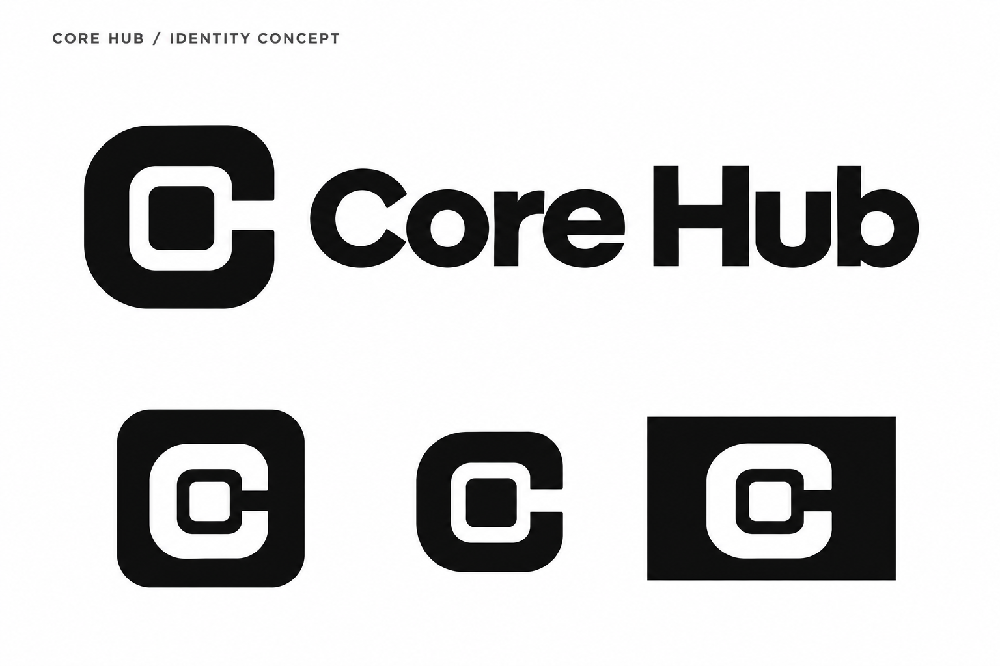

# Core Hub — مقترح الهوية

تصور أولي لمركز ينسّق الايجنتات والمحادثات والأدوات وسير العمل. اختيار الهوية وتغيير اسم المنتج العام لصاحب المشروع.

## الفكرة

بوابة هندسية على شكل **C** تحيط بنواة مستقلة. النواة تمثل مركز العمل، والفتحة تمثل اتصال المركز بمحركات الايجنتات والأدوات. الرمز المدمج يعمل وحده؛ يظهر اسم **Core Hub** في النسخة الأفقية.

الأساس أحادي اللون: الأسود والأبيض. وضوح الشكل أهم من التفاصيل الدقيقة، حتى يكون قابلًا للاستخدام في أيقونة التطبيق والويب وشريط النظام.

## الملفات

| الملف | الصيغة والمقاس | الاستخدام |
| --- | --- | --- |
| [لوحة الهوية](core-hub-identity-concept.png) | PNG معتم، 1536×1024 | مراجعة الرمز والاسم والتطبيقات الفاتحة والداكنة |
| [الرمز المستقل](core-hub-symbol.png) | PNG بشفافية فعلية، 1254×1254 | تصور الرمز الأسود على الخلفيات الفاتحة |
| [أيقونة التطبيق](core-hub-app-icon.png) | PNG معتم، 1254×1254 | رمز أبيض على مربع أسود للواجهات الداكنة وأيقونة التطبيق |
| [أوامر التوليد](prompts.txt) | نص | توثيق مصدر التصورات وإعادة تطويرها |

هذه أصول مراجعة raster، ولا تُستهلك داخل التطبيق الحالي. أنشئت بمساعدة أداة image_gen المدمجة، ثم اختيرت المخرجات الموضحة هنا بعد الفحص البصري. لم يُغيَّر الشعار الحالي أو اسم المنتج في ملفات التشغيل.

## قواعد الاستخدام المقترحة

- اكتب الاسم **Core Hub** مع الحفاظ على المسافة وحالة الأحرف.
- استخدم الرمز وحده في الأيقونات الصغيرة، والرمز مع الاسم في المساحات الأفقية.
- حافظ على النسب ومساحة خالية حول الرمز لا تقل عن عرض النواة الداخلية.
- استخدم النسخة السوداء على خلفية فاتحة، والبيضاء على خلفية داكنة.
- أبقِ الفراغ بين البوابة والنواة واضحًا؛ لا تضف حدودًا أو ظلالًا أو تفاصيل داخلية.

## تجهيز الدمج بعد اختيار التصميم

1. إعداد أصل SVG هندسي قابل للتحرير وتثبيت النسب بصريًا.
2. ضبط نسخة صغيرة بصريًا عند 16 و24 و32 بكسل، ونسخة أعلى دقة لعرض التطبيق.
3. تصدير الويب وfavicon وPWA وWindows ICO وmacOS ICNS/Icon Composer وLinux PNG وأيقونات شريط النظام حسب العقود الموجودة.
4. تحديث تعريفات المقاسات ونوع الملف والشفافية لتطابق الأصول الفعلية.
5. فحص السياقات الفاتحة والداكنة والتغليف على المنصات المستهدفة.

لا تتطلب الهوية تغيير معرّفات Hermes وEkko أو API أو أسماء الحزم أو مسارات البيانات. تبقى LICENSE ونسبة EKKOLearnAI ورخص الأطراف الثالثة كما هي؛ إعادة التسمية لا تغيّر أصل المشروع.

سجل المهمة: [2026-09-17-aboawadh-core-hub-identity](../../changes/2026-09-17-aboawadh-core-hub-identity.md).

